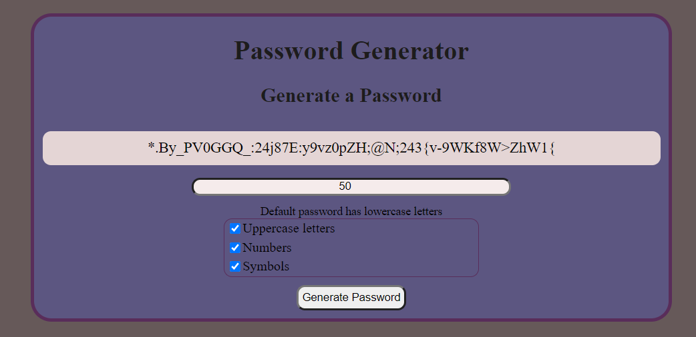

# Password Generator

This application will generate a password containing
 a string of random characters at a desired length

 The white blank space will display a password once certain criteria are met:
 1. A user must first enter a desired password length between 8 and 128 characters.
 1. A user must select from 3 additional characters to include by checking boxes:
    1. Uppercase letters
    1. Numbers
    1. Symbols 
       *(lowercase letters are used by default)*
1. After selections are made the 'Generate Password' button must be pressed, 
   or the enter key pressed from inside the password length input form.

### Small issue with the code
Unfortunately the way the javascript is coded, there is a small chance that the randomly
generated password will exclude one or more of the checked characters. This is do to length
string increasing for each extra character that is checked.  
Ex: If the password length is 8 and no boxes are checked, the string created will have 8
lowercase letters. If the Uppercase letters box is checked the string created will contain 16 characters, but the function will still only pull 8 characters from the string. So it is possible that the 8 characters pulled
will only include uppercase or lowercase letters. This becomes less likely as the password length is increased
and more boxes are checked.
